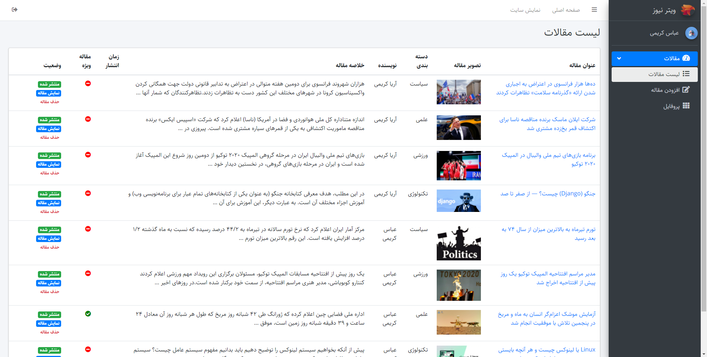

# WaiterNews
WaiterNews is a news and blog application where users can post their thoughts, articles and news.

##  How to run the app
1. Either fork or download the app and open the folder in the cli
2. Make sure you have the Docker app running on your computer, you can download docker from [here](https://www.docker.com/products/docker-desktop)
3. Build the Docker Image by running `docker-compose -f docker-compose-deploy.yml build`
4. run this command to start the multicontainer application `docker-compose -f docker-compose-deploy.yml up`
5. Go to http://localhost:80/ in your browser and post something

## How post an article or news
1. Click 'ورود به سایت' and login to application.
2. Click 'افزودن مقاله' and post your article.

## User Stories
- A user can post articles and news.
- A user can share articles and news.
- A user can comment on articles and news.
- A user can rate on articles and news.
- A user can make profile with image and bio.

## Features
- articles or news ('مقالات و اخبار')
  - articles or news from normal users gets sent to admin page.  
  - articles or news must be publish by admin.
  - if articles or news have 'چک نویس' status, wont be sent in admin page.
  - only special users can see special articles.
  
- category ('دسته بندی')
  - articles or news ordered by category
  - can click on category name and only see articles and news for those category
  
- hot articles & news ('مقالات داغ ماه')
  - hot articles is most comment on post per month which ordered in left side on page 'مقالات داغ ماه'.
  
- most view articles & news ('پر بازدید ماه')
  - hot articles is most view on post per month which ordered in left side on page 'پر بازدید ماه'.
  

## Dependencies
- Python
- Django
- PostgreSQL
- DRF
- Django Packages

## What the app looks like

